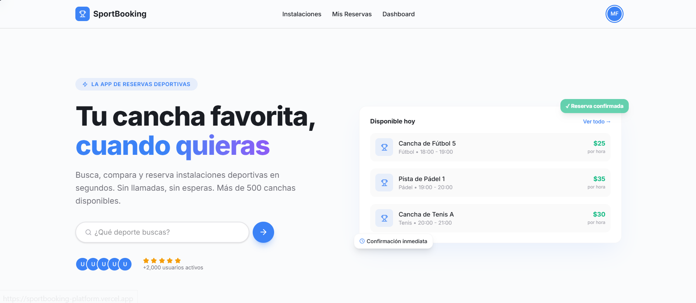
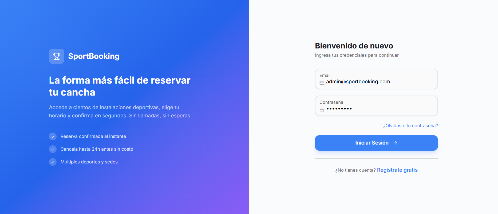
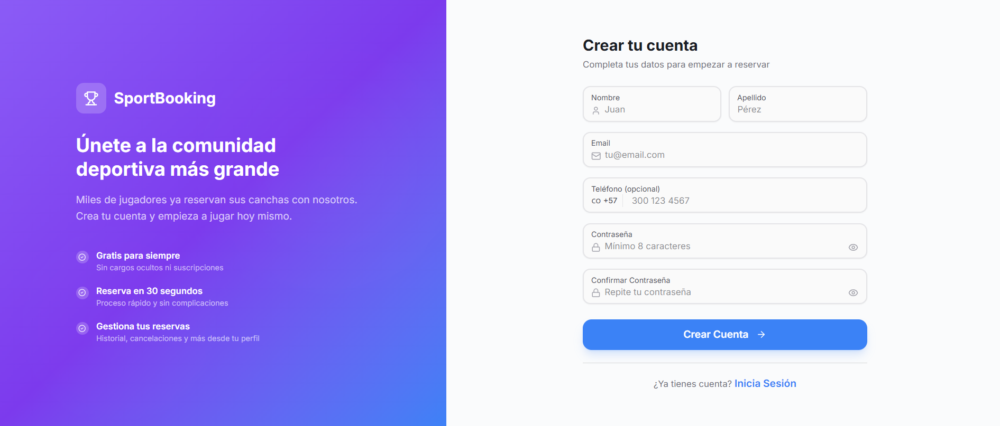
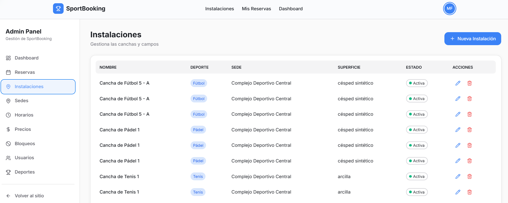
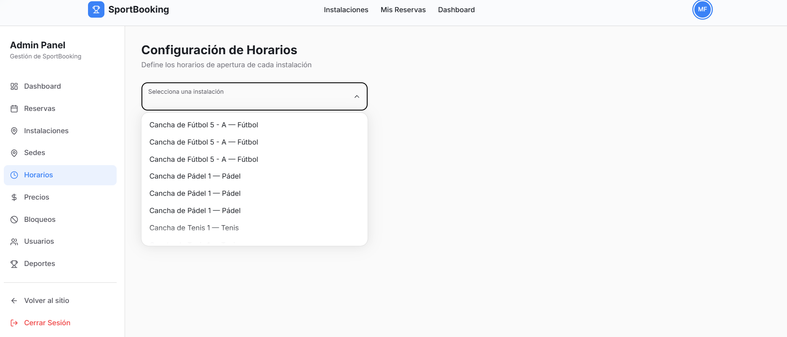
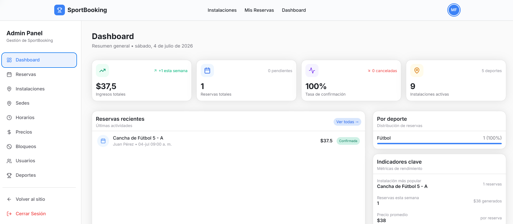

# SportBooking Platform

Plataforma para gestión y reserva de instalaciones deportivas.

## 📸 Screenshots

### Landing Page


### Inicio de Sesión


### Registro


### Explorar Instalaciones


### Detalle y Reserva de Instalación


### Dashboard Admin


---

## Requisitos

- Node.js 18+
- Cuenta gratuita en [Neon](https://neon.tech) (base de datos PostgreSQL en la nube)

## Setup Rápido (5 minutos)

### 1. Crear base de datos en Neon (gratis)

1. Ve a https://neon.tech y crea una cuenta
2. Crea un proyecto nuevo (nombre: "sportbooking")
3. Click en **Connect** → copia el connection string
4. Abre `backend/.env` y pega tu connection string en `DATABASE_URL`

### 2. Backend

```bash
cd backend
npx prisma migrate dev --name init
npx prisma db seed
npm run start:dev
```

El backend corre en http://localhost:3001
Swagger docs en http://localhost:3001/api/docs

### 3. Frontend

```bash
cd frontend
npm run dev
```

El frontend corre en http://localhost:3000

## Usuarios de prueba

| Email | Contraseña | Rol |
|-------|-----------|-----|
| admin@sportbooking.com | Admin123! | ADMIN |
| client@sportbooking.com | Client123! | CLIENT |

## Stack

- **Frontend**: Next.js 15, React 19, HeroUI, TailwindCSS 4, TanStack Query, Zustand
- **Backend**: NestJS, Prisma, PostgreSQL, JWT
- **DB**: PostgreSQL (Neon)
